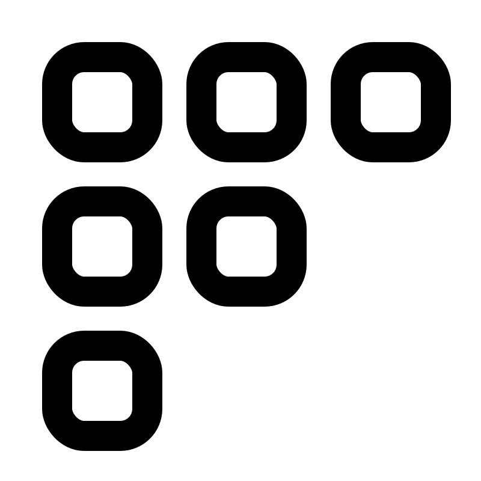

  
  <h1 style="text-align: center; margin-top: 10px;">Flipbook</h1>

## Getting Started

Flipbook is a series of libraries that you can use in any web, mobile, or desktop application that enable the writing and reading of QR codes that contain larger payloads than traditional QR codes. This is done by creating a series of QR codes that are stitched together into an animated GIF, called a "Flipbook". This Flipbook can then be scanned by the reader library and subsequently reassembled into the original payload.

**[Download Reader](https://flipbook.codes)**

### Why?

The ubiquity of QR codes in daily life has made them a popular tool for sharing information. But the medium is inherently limited to payloads of small sizes. While larger payloads can be supported (to a point), the resulting QR code becomes too difficult to scan reliably.

### Are there any size limitations?

In theory, no. It would simply be a matter of how long it takes for the writer to encode the payload into a Flipbook, and how long it takes for the reader to decode the Flipbook back into the original payload.

### What can a Flipbook contain?

Anything! Books... movies... music... software... anything that can be represented as a series of bytes can be encoded into a Flipbook.

## Libraries

- Writer (Typescript): [Documentation](./packages/writer) | [NPM Package](https://www.npmjs.com/package/@flipbook/writer)
- Reader (Typescript): [Documentation](./packages/reader) | [NPM Package](https://www.npmjs.com/package/@flipbook/reader)
- Writer (Rust): *Coming soon...*
- Reader (Rust): *Coming soon...*

### Want to write a Flipbook binding?

If you want to write a Flipbook binding for a language that isn't listed here, feel free to open an issue or a pull request. We'd love to see Flipbook supported in as many languages as possible!

## Contributing

If you'd like to contribute to Flipbook, please read our [contributing guide](./CONTRIBUTING.md) to learn how to get started.

## License

Flipbook is licensed under the [MIT License](./LICENSE). Go nuts!
